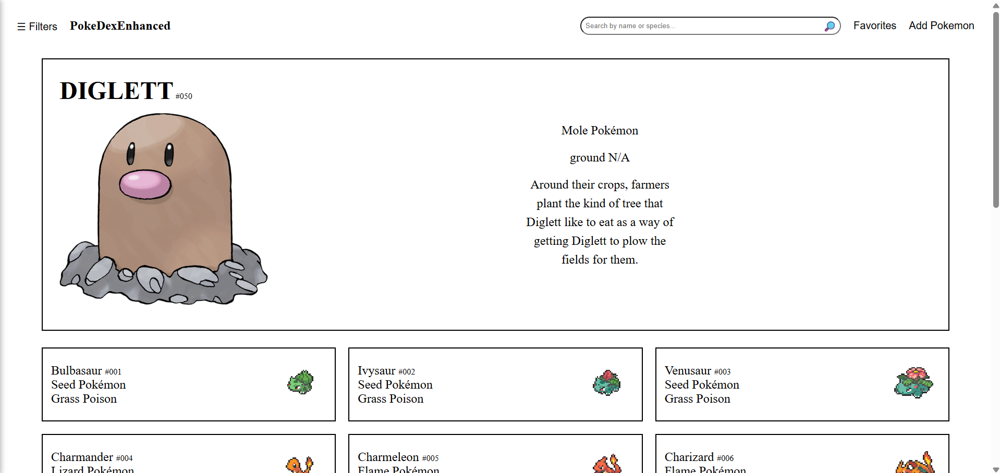

# Pokedex Web App

A sleek, interactive Pokemon built using **vanilla JavaScript, HTML, and CSS**. This app allows users to **search**, **filter**, **edit**, and **favorite** Pokemon, mimicking the UI of a dynamic single-page application — all without a framework.



[🔗 Live Demo on GitHub Pages](https://elmarmar.github.io/PokeDexEnhanced/)

## 🔍 Features

- **Live Search** by name or species
- **Filter** by Pokemon type (dual-type supported)
- **Sort** by ID, Name, or other attributes
- **In-browser Editing** of Pokemon data (name, species, image, etc.)
- **Favorite Pokemon** and view them in a modal
- **Upload custom images** (with preview support)
- **Pagination** for performance with large datasets
- **Modular architecture** using ES6 Modules
- No frameworks, just performance-optimized DOM handling

## Getting Started

### 1. Clone the Repository

```bash
git clone https://github.com/elmarmar/PokeDexEnhanced.git
cd PokeDexEnhanced
```

## Credits

Pokemon data from (https://github.com/Purukitto/pokemon-data.json)
